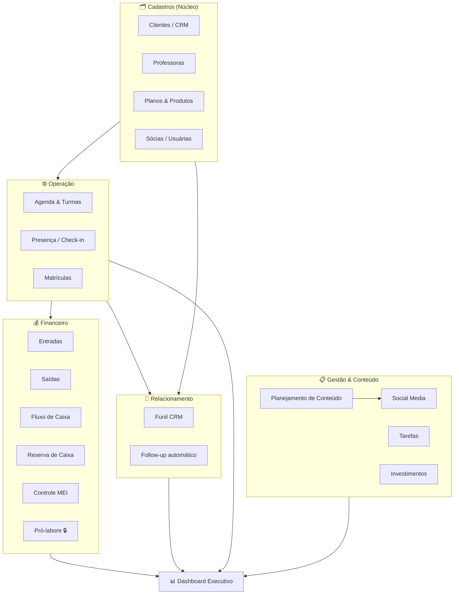
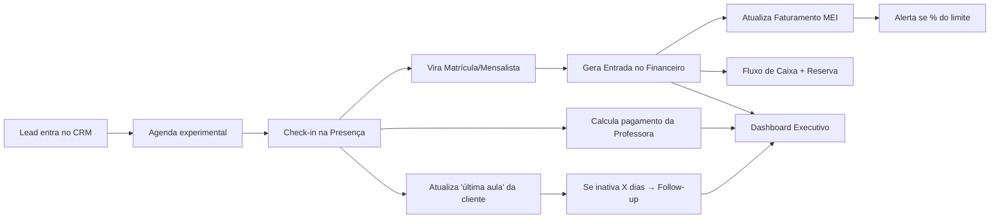
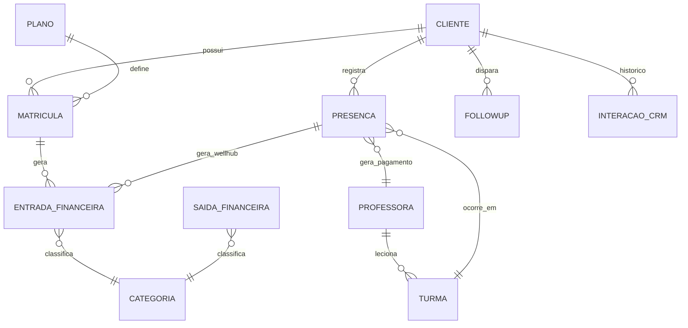

# Arquitetura & Stack — Studio Pole L

> Decisões técnicas, mapa de módulos, fluxo de informação, roadmap e
> oportunidades de skills. Base para o `CLAUDE.md`.

---

## 1. Princípios de arquitetura

1. **Simples hoje, preparado para crescer** — nada de over-engineering.
2. **Modular e integrado** — cada módulo é independente, mas compartilha dados via
   banco único. Um evento em um módulo reflete nos outros.
3. **O banco é a fonte de verdade** — regras de negócio críticas (segurança,
   totais, MEI) ficam no Postgres, não só no front.
4. **Custo próximo de zero** para 3 usuárias (tiers gratuitos).
5. **Feature flags** para ligar/desligar módulos futuros (pró-labore, ClassPass).

---

## 2. Stack recomendado

| Camada | Tecnologia | Por quê |
|---|---|---|
| **Frontend** | **React + TypeScript + Vite** | SPA rápida, componível, tipagem segura |
| **UI** | **Tailwind CSS** + componentes próprios | Minimalista, muito espaço em branco, poucas cores |
| **Estado/Dados** | **TanStack Query** + cliente Supabase | Cache, sincronização, menos boilerplate |
| **Backend / Banco** | **Supabase (Postgres)** | Banco + Auth + RLS + Realtime + Storage num só serviço |
| **Autenticação** | **Supabase Auth** | Login das 3 sócias, papéis, RLS por usuária |
| **Segurança de dados** | **Row Level Security (RLS)** | Regras no banco, não confia só no front |
| **Automação** | **Supabase Edge Functions** + **pg_cron** | Follow-ups, alertas MEI, recorrências |
| **Hospedagem** | **GitHub Pages** | Grátis, simples; SPA estática falando com Supabase |
| **CI/CD** | **GitHub Actions** | Build + deploy automático no push |
| **Código** | **GitHub** (repositório) | Versionamento e histórico |

### Por que essa combinação funciona
A SPA (React) é 100% estática — perfeita para **GitHub Pages**. Ela conversa
direto com o **Supabase** (dados, auth, arquivos). A segurança **não depende** de o
site ser público: o RLS no Postgres garante que só sócias autenticadas leiam/escrevam.
Automações (alertas, follow-up) rodam no Supabase (cron + edge functions),
independentes do navegador estar aberto.

### ✅ Decisão de hospedagem (definida)
**Repo público + GitHub Pages (grátis).** O *código-fonte* fica visível
publicamente, mas os *dados* não — estão protegidos por Supabase Auth + RLS.
Implicações práticas que o projeto vai respeitar:
- **Nunca** commitar segredos. Só a `anon key` do Supabase vai para o front (ela é
  pública por design; a segurança real é o RLS). A `service_role key` jamais no repo.
- Toda tabela nasce com **RLS habilitado** e políticas explícitas.
- Variáveis de ambiente do build injetadas via **GitHub Actions secrets**.

---

## 3. Mapa de módulos (organização lógica em camadas)

> 🔒 = módulo preparado mas desativado por *feature flag*.

---

## 4. Fluxo de informação entre módulos

O grande valor do sistema é a **integração**. Exemplo do ciclo principal:

**Regras de integração-chave:**
- Um **check-in** atualiza *ao mesmo tempo*: pagamento da professora, ocupação da
  turma, "última aula" da cliente e (se Wellhub) receita a reconciliar.
- Uma **entrada financeira** atualiza automaticamente faturamento MEI, fluxo de
  caixa e reserva.
- Toda **mudança de estágio no funil** ou **inatividade** pode gerar follow-up.

---

## 5. Roadmap de desenvolvimento (valor primeiro)

Ordem pensada para entregar o que **mais dói hoje (planilhas + MEI)** primeiro,
respeitando dependências entre módulos.

| Fase | Entrega | Valor |
|---|---|---|
| **Fase 0 — Fundação** | Repo, Supabase, Auth das sócias, deploy (Actions→Pages), design system minimalista, feature flags | Base técnica |
| **Fase 1 — Clientes + CRM** ⭐ | Cadastro, funil visual, histórico/interações | Base de relacionamento — **ponto de partida escolhido** |
| **Fase 2 — Financeiro + MEI** | Entradas, Saídas (fixas/variáveis), Fluxo de caixa, Controle MEI com alertas | 🔥 Substitui a planilha mais crítica |
| **Fase 3 — Follow-up** | Automações por gatilho (cron + edge functions) | Retenção automática |
| **Fase 4 — Agenda & Presença + Professoras** | Turmas, check-in, cálculo de pagamento | Coração operacional |
| **Fase 5 — Dashboard Executivo** | Indicadores agregando todos os módulos | Visão executiva |
| **Fase 6 — Conteúdo + Social + Tarefas + Investimentos** | Produtividade e planejamento | Organização do time |

> Reserva de Caixa e Pró-labore entram junto do Financeiro, mas Pró-labore fica
> **desligado** por flag até o negócio pedir.
>
> **Nota de dependência:** o Follow-up de *inatividade* (sem check-in há X dias)
> só fica 100% automático após a Fase 4 (Presença). Até lá, os gatilhos de
> Follow-up baseados em CRM (lead sumiu, experimental, aniversário) já funcionam.

---

## 6. Oportunidades de Skills do projeto

Skills reutilizáveis que vão acelerar o desenvolvimento módulo a módulo:

| Skill | O que faz |
|---|---|
| **`novo-modulo`** | Scaffold completo de um módulo: migration (tabela + RLS) → tipos TS → página React + rota + item de menu, seguindo o padrão do projeto |
| **`supabase-migration`** | Cria/aplica migration versionada com convenções de RLS e nomenclatura |
| **`regras-financeiras`** | Conhecimento de domínio: categorias, regra do MEI (81k, alertas), reconciliação Wellhub, reserva — para gerar código financeiro consistente |
| **`seed-dados`** | Popula o banco com dados de exemplo realistas para testar telas |
| **`deploy`** | Roda build + validações e publica no GitHub Pages via Actions |
| **`design-system`** | Garante consistência visual minimalista (tokens, espaçamento, componentes) em telas novas |

> Essas skills serão criadas junto da Fase 0/1, conforme os padrões aparecem.

---

## 7. Modelo de dados inicial (esboço de alto nível)

Entidades centrais e como se conectam (detalhado por módulo na implementação):

