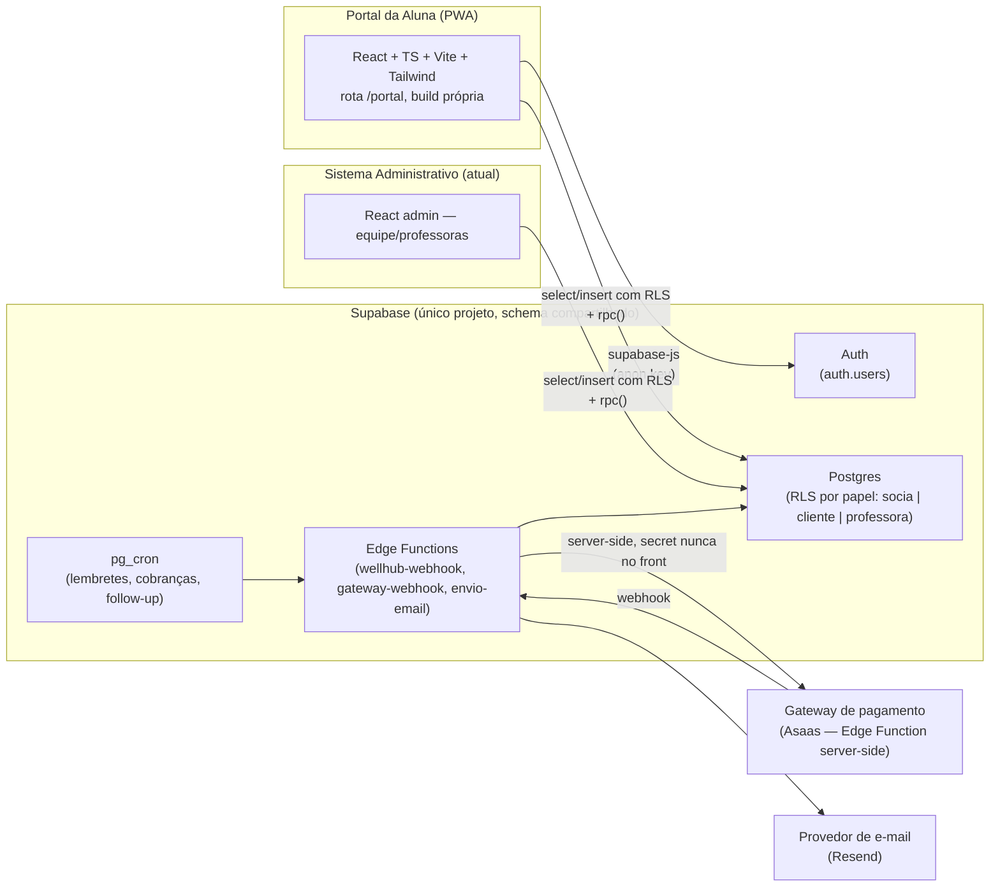
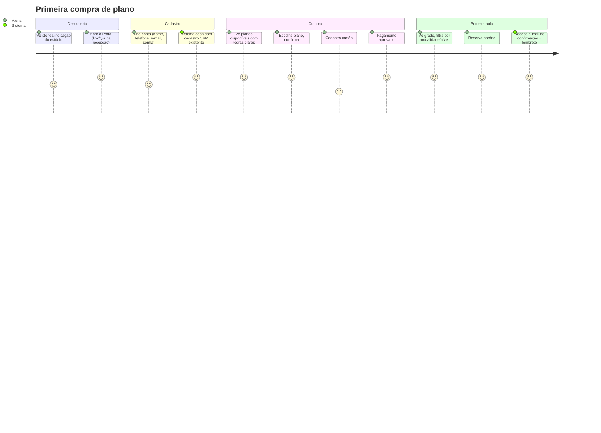
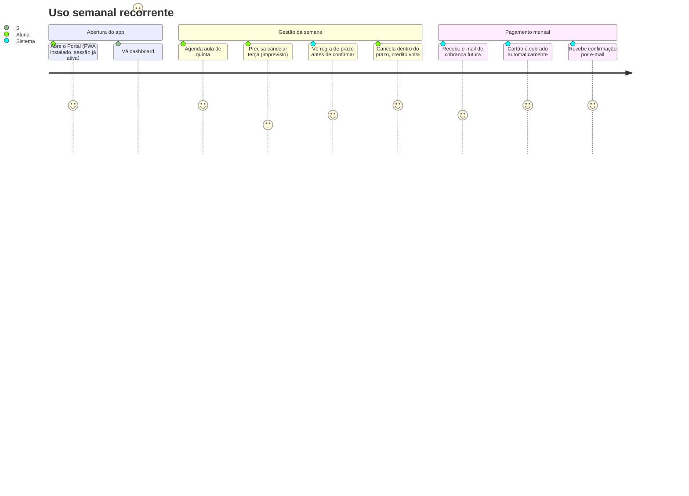
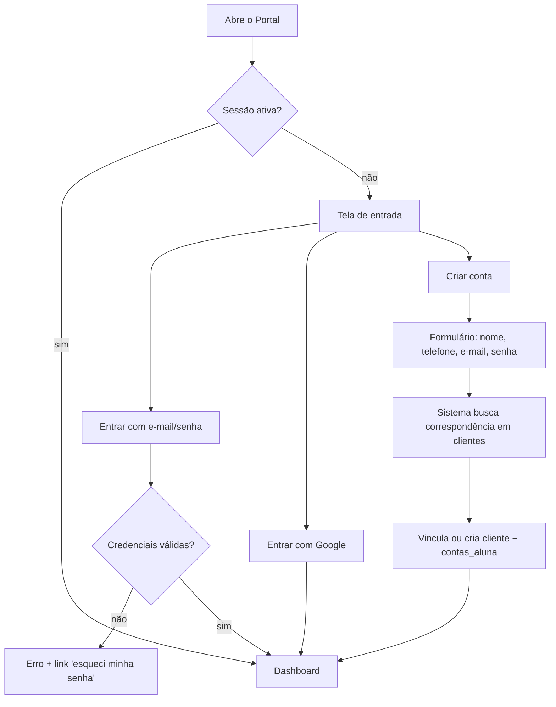
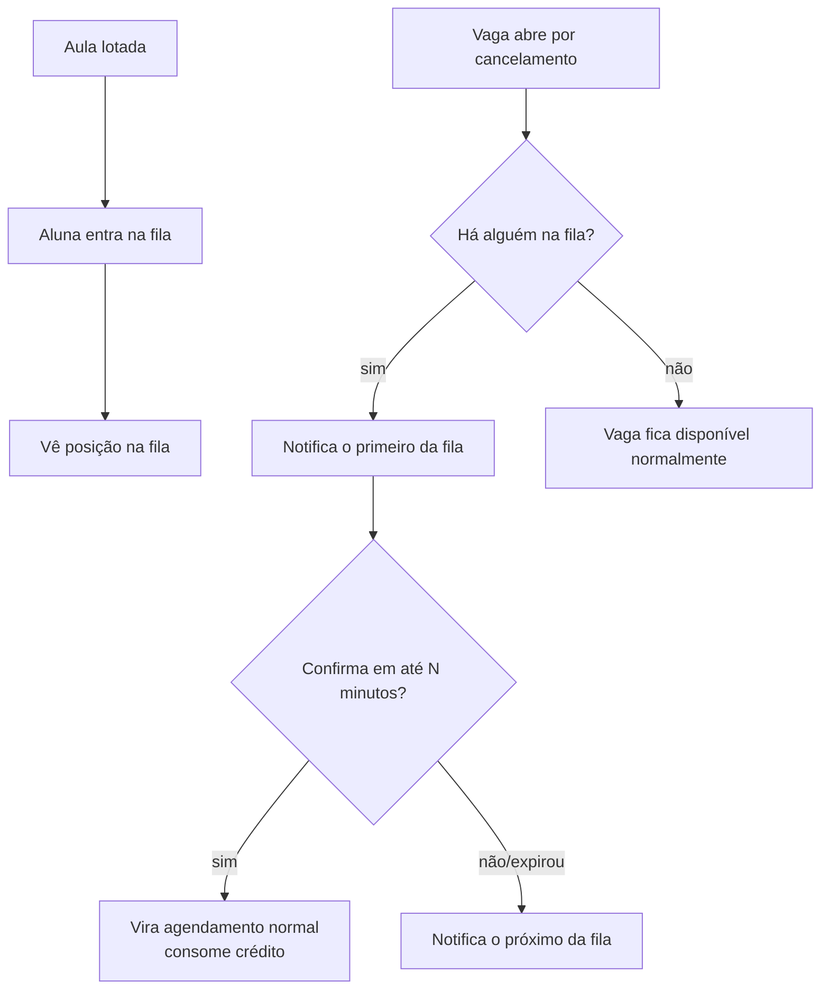
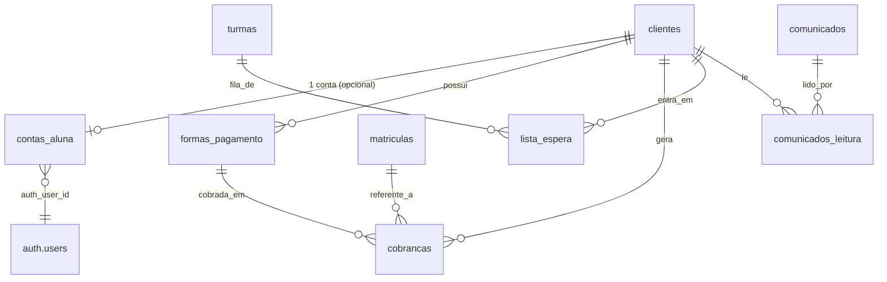

# 04 — Portal da Aluna (Especificação Funcional)

Documento de especificação de produto para o módulo **Portal da Aluna**: a única
interface do sistema acessada por clientes (mensalistas e, opcionalmente,
alunas Wellhub híbridas). Não é um documento de código — define o que deve
existir, por quê, e em que ordem. Antes de implementar, seguir o fluxo padrão
da seção 11 do [CLAUDE.md](../CLAUDE.md#11-como-trabalhar-fluxo-por-módulo):
validar modelo de dados com a equipe antes de gerar migration.

Referência de regras de negócio já registradas: [CLAUDE.md §9](../CLAUDE.md#9-regras-de-negócio--agendamento--turmas-wellhub-e-mensalista)
(agendamento/vaga/crédito) e §9.5–9.6 (contas de acesso e permissões de
professora). Este documento **expande** essas seções para o caso específico da
aluna; não as contradiz.

---

## 0. O que já existe vs. o que é novo

Levantamento no schema atual (Supabase, Fases 0–4 já implementadas) antes de
desenhar qualquer coisa nova, para não duplicar modelo:

| Conceito | Situação |
|---|---|
| Crédito de plano | **Já existe** — ledger `creditos_eventos` + view `vw_saldo_creditos` |
| Vaga/capacidade de turma | **Já existe** — `turmas.capacidade` + trigger `validar_vaga_agendamento()` (lock + contagem) |
| Cancelamento com prazo configurável | **Já existe** — `config_agendamento.horas_cancelamento`, aplicado em `cancelar_agendamento()` |
| Reposição com limite | **Já existe** — `config_agendamento.max_reposicoes_por_matricula` + trigger `validar_reposicao()` |
| Agendar/cancelar/matricular | **Já existe como RPC** — `agendar_aula()`, `cancelar_agendamento()`, `matricular()` — mas **todas bloqueiam quem não é da equipe** (`if not is_socia() then raise exception` — `is_socia()` é o nome da função no código hoje, ainda que a equipe do studio inclua mais gente além das sócias legais). Isso precisa ser revisado, não recriado. |
| Login de cliente | **Não existe.** Só `public.socias` está ligada a `auth.users`. `clientes.id` é independente de qualquer login. |
| RLS para "a própria cliente" | **Não existe.** Toda policy hoje é `is_socia()`. |
| Lista de espera | **Não existe.** Não há tabela, enum nem função. |
| Pagamento/gateway (Stripe/Asaas/etc.) | **Não existe.** Nenhuma integração, nenhuma tabela de cobrança. |
| Central de comunicados | **Não existe.** |
| Emails automáticos | **Não existe** infraestrutura de envio (só a edge function `wellhub-webhook`, que é de entrada, não de envio). |

Ou seja: a "vaga única compartilhada" e o "motor de créditos" — o coração do
sistema — já estão prontos e testados no admin. O Portal da Aluna **não
reimplementa** essas regras; ele **expõe** essas mesmas RPCs/tabelas para um
novo papel (`cliente`), com RLS própria. O trabalho novo de verdade é: conta de
acesso, pagamento recorrente, lista de espera e comunicação.

### Decisões de escopo assumidas (revisáveis)

1. **Gateway de pagamento recomendado para o MVP: Asaas.** Motivo: split de
   cartão recorrente + PIX + boleto nativos, onboarding de MEI mais simples que
   Stripe (que exige mais estrutura de compliance internacional), e mercado
   BR-first. A arquitetura abaixo é **agnóstica de provedor** (tabela
   `formas_pagamento`/`cobrancas` guarda um `provider` + `provider_ref` opaco),
   então trocar por Pagar.me/Mercado Pago depois é troca de Edge Function, não
   de schema. Isso é recomendação, não obrigação — confirmar com a equipe
   antes da Fase de pagamentos (não bloqueia MVP de agendamento).
2. **Multi-unidade/franquia: adiado.** A seção 4 do CLAUDE.md já manda não
   desenhar para requisitos hipotéticos. Não criamos `unidade_id` agora; o
   único cuidado é não hardcodar "estúdio único" em lugar algum que torne a
   migração futura destrutiva (ex.: não assumir 1 fuso horário fixo, não
   assumir 1 config global sem chave). Se/quando houver 2ª unidade, entra como
   nova fase, não como retrabalho.
3. **App nativo (iOS/Android): fora de escopo agora.** O Portal nasce como
   **PWA mobile-first** dentro do mesmo repo (nova rota `/portal`, build
   separado do admin). Ver §1.2.
4. **E-mail transacional:** nenhum provedor está integrado hoje. Recomendação:
   **Resend** (API simples, bom para Edge Functions Deno do Supabase). Entra
   junto com a Fase de comunicação (não é pré-requisito do agendamento).

---

## 1. Arquitetura completa

### 1.1 Visão geral



**Decisão-chave:** não é um "backend novo". É o **mesmo projeto Supabase**,
mesmo Postgres, mesmas regras de negócio (RPCs `agendar_aula`,
`cancelar_agendamento` etc. reaproveitadas) — só um **novo papel de RLS**
(`cliente`) e um **novo frontend** que consome esse papel. Isso cumpre
diretamente a demanda da seção "Arquitetura" do pedido original: *"O Portal da
Aluna apenas consumirá essas informações através das APIs internas."*

### 1.2 Por que rota separada, não app novo

- **Um único projeto Vite, dois entry points** (`src/admin/` e
  `src/portal-aluna/` — ver reestruturação de pastas em §11) — Compartilha
  `src/lib/supabase.ts`, tipos gerados (`database.types.ts`), design tokens.
  Evita duplicar cliente Supabase, auth listener, etc.
- **Deploy:** mesmo pipeline GitHub Actions → GitHub Pages, mas dois caminhos
  (`/` = admin, `/portal` = aluna) ou dois builds publicados em paths
  diferentes do mesmo Pages. Detalhe de implementação da Fase 0 do módulo, não
  bloqueia a especificação funcional.
- **PWA:** manifest + service worker **apenas no bundle do Portal** (o admin
  não precisa ser instalável). Dá o "parecer app nativo" pedido sem o custo de
  loja de app nem revisão da Apple/Google.

### 1.3 Autenticação e papéis — o que precisa ser criado

Hoje `is_socia()` é a única função de papel. Precisamos do equivalente para
cliente, seguindo exatamente o mesmo padrão já validado:

- Nova tabela **`contas_aluna`**: `auth_user_id uuid PK references auth.users(id) on delete cascade`,
  `cliente_id uuid not null references clientes(id) on delete cascade`,
  `criada_em timestamptz`. (Por que tabela separada e não coluna
  `auth_user_id` direto em `clientes`: uma cliente Wellhub pode existir em
  `clientes` **sem nunca** ter conta — a FK teria que ser nullable de qualquer
  jeito; uma tabela de vínculo deixa explícito "isto é uma conta", e facilita
  auditoria de quando a conta foi criada, separado do cadastro CRM que pode ser
  bem mais antigo.)
- Nova função `public.is_cliente() returns boolean security definer` — mesmo
  padrão de `is_socia()`: `exists (select 1 from contas_aluna where auth_user_id = auth.uid())`.
- Nova função `public.cliente_atual() returns uuid security definer` —
  retorna o `cliente_id` da conta logada (equivalente a "meu id de cliente"),
  usada em todas as policies novas (`cliente_id = cliente_atual()`).
- **Revisar `handle_new_user()`:** hoje todo signup vira membro da equipe
  automaticamente (comentário explícito na migration da Fase 1 já avisa que
  isso mudaria aqui). Passa a rotear por metadata do signup
  (`raw_user_meta_data->>'papel'`) ou por qual formulário originou o cadastro
  — signup do admin sempre marca equipe; signup do Portal sempre marca
  cliente.
- **Revisar as RPCs existentes** (`agendar_aula`, `cancelar_agendamento`,
  `matricular`) removendo o bloqueio automático de quem não é da equipe e
  substituindo por uma validação de que **o `p_cliente` da chamada é o
  `cliente_atual()`** quando quem chama é `is_cliente()` (uma aluna não pode
  agendar em nome de outra). A equipe continua podendo agendar em nome de
  qualquer cliente (uso do balcão/telefone).
- **Nova policy por tabela** para o papel cliente (detalhado por tabela em
  §11.4) — sempre `using (cliente_id = cliente_atual())`, nunca acesso amplo.

### 1.4 Fluxo de criação de conta (liga ao CRM existente)

Ponto de atenção de produto: a cliente **já existe** em `clientes` antes de
ter conta (foi cadastrada pela recepção/CRM, ou chegou via Wellhub). Signup no
Portal não pode criar um cliente duplicado. Fluxo:

1. Aluna informa telefone ou e-mail no signup.
2. Sistema busca em `clientes` por correspondência (telefone/e-mail/nome +
   confirmação) — se achar, **vincula** a conta nova a esse `cliente_id`
   existente (grava em `contas_aluna`). Se não achar, cria um novo registro em
   `clientes` (`origem` = o que a aluna informar) e vincula.
3. Esse casamento evita "conta órfã" e mantém o histórico de CRM (interações,
   estágio de funil) já existente ligado à mesma pessoa.

---

## 2. Jornada da usuária

Três jornadas distintas cobrem praticamente todo o uso real (vs. inventar uma
jornada genérica única):

### 2.1 Aluna nova, mensalista, primeiro acesso



### 2.2 Aluna Wellhub pura (sem conta) migrando para híbrida

Cobre a regra §9.5 do CLAUDE.md: Wellhub não precisa de conta para o básico. A
jornada só entra no Portal se ela **quiser algo a mais** (ex: comprar o
complemento Passe Livre ou a ponte Studio+, já definidos na estratégia de
migração Wellhub discutida com a equipe):

1. Continua agendando/check-in **pelo app Wellhub normalmente** — zero
   fricção, zero conta.
2. Vê em algum ponto de contato (recepção, story, comunicado por WhatsApp) uma
   oferta de plano complementar do estúdio.
3. Só **nesse momento** cria conta no Portal — pulando direto para o fluxo de
   compra (2.1, a partir de "Compra"), sem precisar re-cadastrar dados básicos
   se o telefone bater com o `clientes` existente (casamento automático).

### 2.3 Aluna recorrente, uso diário/semanal (o caso mais comum)



### 2.4 Caso de borda — inadimplência

1. Cobrança recusada (cartão vencido/sem limite) → status da assinatura muda
   para `inadimplente` → e-mail imediato "seu pagamento não foi aprovado".
2. Dashboard do Portal mostra banner no topo (não bloqueia navegação de graça,
   mas deixa claro): *"Sua última cobrança não foi aprovada. Atualize seu
   cartão para continuar agendando."*
3. Regra de negócio a validar com a equipe (não assumir sozinho): a aluna
   inadimplente **pode continuar agendando** com o crédito que já tinha, ou
   **fica bloqueada para novos agendamentos** até regularizar? Recomendação:
   bloquear apenas *nova compra/renovação*, não os créditos já pagos e não
   usados (ela já pagou por eles). Ver §8.6.

---

## 3. Fluxos de navegação

### 3.1 Login / cadastro



### 3.2 Compra de plano

```mermaid
flowchart TD
    A[Área de Planos] --> B[Seleciona plano]
    B --> C[Tela de detalhes + regras]
    C --> D[Confirmar compra]
    D --> E{Já tem cartão salvo?}
    E -- sim --> F[Escolhe cartão salvo ou novo]
    E -- não --> G[Cadastra cartão]
    F --> H[Revisão final: valor, recorrência, início]
    G --> H
    H --> I[Processa pagamento via gateway]
    I --> J{Aprovado?}
    J -- sim --> K[matricular() é chamado\ncréditos liberados no perfil]
    J -- não --> L[Tela de erro claro + tentar outro cartão]
    K --> M[Confirmação + CTA 'Agendar primeira aula']
```

### 3.3 Agendamento

```mermaid
flowchart TD
    A[Grade de horários] --> B[Filtra modalidade/professora/nível/dia]
    B --> C[Toca na aula]
    C --> D{Status da aula}
    D -- Disponível/Poucas vagas --> E[Ver detalhes]
    D -- Lotada --> F[Entrar na lista de espera]
    E --> G[Confirmar reserva]
    G --> H{Tem crédito/vaga semanal disponível?}
    H -- sim --> I[agendar_aula() via RPC]
    H -- não --> J[Aviso: sem créditos — ir para Planos]
    I --> K[Reserva confirmada + e-mail]
```

### 3.4 Cancelamento / remarcação

```mermaid
flowchart TD
    A[Minhas Reservas] --> B[Toca em uma reserva]
    B --> C{Ação}
    C -- Cancelar --> D[Modal: mostra prazo, se há multa, se crédito volta]
    D --> E[Confirma cancelamento]
    E --> F[cancelar_agendamento(origem='aluna')]
    F --> G{Dentro do prazo config?}
    G -- sim --> H[Crédito devolvido + vaga liberada]
    G -- não --> I[Crédito não devolvido + vaga liberada]
    C -- Remarcar --> J[Mesmo fluxo de cancelar]
    J --> K[Redireciona para Grade já filtrada\npela mesma modalidade]
    K --> L[Escolhe novo horário]
    L --> M[Confirma nova reserva]
```

### 3.5 Lista de espera (fluxo novo, sem equivalente hoje no admin)



---

## 4. Mapa de telas

| # | Tela | Rota | Objetivo |
|---|---|---|---|
| 1 | Entrada/Login | `/portal/entrar` | Autenticar ou iniciar cadastro |
| 2 | Cadastro | `/portal/cadastro` | Criar conta + casar com cliente existente |
| 3 | Recuperar senha | `/portal/recuperar-senha` | Reset via e-mail |
| 4 | Dashboard | `/portal` | Resumo: próxima aula, saldo, comunicados, CTAs |
| 5 | Planos (lista) | `/portal/planos` | Ver planos disponíveis |
| 6 | Detalhe do plano | `/portal/planos/:id` | Regras + botão comprar |
| 7 | Checkout | `/portal/planos/:id/comprar` | Fluxo de compra (multi-step) |
| 8 | Grade de horários | `/portal/agenda` | Ver/filtrar aulas, entrar em uma |
| 9 | Detalhe da aula | `/portal/agenda/:turmaId/:data` | Reservar/lista de espera |
| 10 | Minhas reservas | `/portal/reservas` | Próximas aulas, cancelar/remarcar |
| 11 | Histórico | `/portal/historico` | Aulas passadas, faltas, reposições |
| 12 | Saldo de créditos | `/portal/saldo` | Créditos/plano/validade |
| 13 | Pagamentos | `/portal/pagamentos` | Cartões, faturas, cobranças |
| 14 | Comunicados | `/portal/comunicados` | Central de avisos |
| 15 | Perfil | `/portal/perfil` | Dados pessoais, foto, LGPD |
| 16 | Preferências | `/portal/preferencias` | Notificações |
| 17 | Suporte/Ajuda | `/portal/ajuda` | FAQ, WhatsApp da recepção |

---

## 5. Wireframes de baixa fidelidade

Convenção: `[  ]` = botão, `( )` = card, `====` = divisor. Mobile-first (largura
~375px de referência); tablet/desktop apenas centralizam o mesmo conteúdo com
mais respiro lateral, não recompõem a hierarquia.

### 5.1 Dashboard (`/portal`)

```
┌─────────────────────────────────┐
│  Olá, Carol 👋           [🔔2] │
├─────────────────────────────────┤
│ ( Plano: Unlimited              )│
│ ( Créditos: 8 de 12             )│
├─────────────────────────────────┤
│ PRÓXIMA AULA                    │
│ ( Hoje • 19:30                  )│
│ ( Pole Flow — Profa. Ana        )│
│ ( [Ver detalhes] [Cancelar]     )│
├─────────────────────────────────┤
│ COMUNICADOS RECENTES            │
│ ( • Workshop dia 20 — novo! )    │
│ ( • Horário de sexta mudou   )   │
│ [Ver todos]                     │
├─────────────────────────────────┤
│  [ Agendar Aula ]  (grande)     │
│  [ Comprar Plano ]              │
├─────────────────────────────────┤
│  🏠    📅    💳    👤   (bottom nav)│
└─────────────────────────────────┘
```

### 5.2 Grade de horários (`/portal/agenda`)

```
┌─────────────────────────────────┐
│ ← Agenda                  [≡]  │  ≡ = filtros
├─────────────────────────────────┤
│ [Seg][Ter][Qua][Qui★][Sex][Sáb] │  ★ = dia selecionado
├─────────────────────────────────┤
│ ( 18:00 Pole Flow               )│
│ ( Profa. Ana · Nível misto      )│
│ ( ●●●○○ 3/5 vagas · Disponível  )│
├─────────────────────────────────┤
│ ( 19:30 Pole Tricks              )│
│ ( Profa. Bia · Avançado         )│
│ ( ●●●●● Lotada                  )│
│ ( [Entrar na lista de espera]   )│
├─────────────────────────────────┤
│ ( 20:30 Alongamento              )│
│ ( Profa. Ana · Todos os níveis  )│
│ ( ●●○○○ Poucas vagas            )│
└─────────────────────────────────┘
```

### 5.3 Detalhe da aula / confirmação (bottom sheet)

```
┌─────────────────────────────────┐
│         Pole Flow               │
│    Qui 19/07 · 19:30–20:30      │
│         Profa. Ana              │
│                                  │
│   Vagas: 3 de 5 disponíveis     │
│   Seu saldo: 8 créditos         │
│                                  │
│   Cancelamento até 4h antes      │
│   sem perda de crédito.          │
│                                  │
│   [   Confirmar reserva   ]      │
│   [        Cancelar        ]     │
└─────────────────────────────────┘
```

### 5.4 Cancelamento (modal)

```
┌─────────────────────────────────┐
│  Cancelar esta aula?             │
│                                  │
│  Pole Flow · Qui 19:30           │
│                                  │
│  ✅ Dentro do prazo (faltam 6h)  │
│  Seu crédito volta para o saldo. │
│                                  │
│  [  Sim, cancelar  ]             │
│  [     Voltar       ]            │
└─────────────────────────────────┘
```
Variante fora do prazo: troca o ✅ por ⚠️ e o texto por *"Fora do prazo de
cancelamento (era até 4h antes). Este crédito não será devolvido."* — nunca
esconder a regra, mesmo quando desfavorável à aluna (alinhado à "casinha":
transparência gera confiança).

### 5.5 Planos (lista)

```
┌─────────────────────────────────┐
│ ← Planos                        │
├─────────────────────────────────┤
│ ( Unlimited                      )│
│ ( R$ 259/mês · aulas ilimitadas  )│
│ ( [Ver detalhes]                 )│
├─────────────────────────────────┤
│ ( 8 créditos                      )│
│ ( R$ 199/mês · validade 30 dias )│
│ ( [Ver detalhes]                 )│
├─────────────────────────────────┤
│ ( Passe Livre (complemento)       )│
│ ( R$ 99/mês · p/ alunas Wellhub  )│
│ ( [Ver detalhes]                 )│
└─────────────────────────────────┘
```

### 5.6 Pagamentos

```
┌─────────────────────────────────┐
│ ← Pagamentos                    │
├─────────────────────────────────┤
│ CARTÃO PRINCIPAL                │
│ ( •••• 4242  Visa   [Principal] )│
│ [Trocar cartão] [Adicionar novo]│
├─────────────────────────────────┤
│ PRÓXIMA COBRANÇA                │
│ ( R$ 259,00 em 05/08             )│
├─────────────────────────────────┤
│ HISTÓRICO                       │
│ ( 05/07  R$259  ✅ Aprovado      )│
│ ( 05/06  R$259  ✅ Aprovado      )│
│ ( 05/05  R$259  ❌ Recusado      )│
│         [Ver comprovante]        │
└─────────────────────────────────┘
```

### 5.7 Perfil

```
┌─────────────────────────────────┐
│ ← Meu Perfil            [📷]   │
├─────────────────────────────────┤
│ Nome         [Carol Nunes    ]  │
│ Telefone     [(11) 9....     ]  │
│ E-mail       [carol@...      ]  │
│ Nascimento   [__/__/____     ]  │
│ Contato emergência [          ] │
├─────────────────────────────────┤
│ [ Salvar alterações ]            │
├─────────────────────────────────┤
│ [ Alterar senha ]                │
│ [ Preferências de notificação ] │
│ [ Sair ]                         │
└─────────────────────────────────┘
```

---

## 6. Navegação mobile

**Bottom navigation fixa, 4 itens** (5 é excessivo para o volume de tarefas do
Portal — "nada poluído", CLAUDE.md §4):

```
🏠 Início   📅 Agenda   💳 Planos/Pagamentos   👤 Perfil
```

- **Início** = Dashboard (§5.1).
- **Agenda** = agrega Grade + Minhas Reservas + Histórico como abas internas
  (não itens separados da bottom nav — evita poluir a barra).
- **Planos/Pagamentos** = agrega Planos, Saldo de créditos e Pagamentos como
  abas internas (mesma lógica).
- **Perfil** = Perfil + Preferências + Comunicados + Ajuda (menu simples).

**Padrões complementares:**
- Header com botão voltar (`←`) em toda tela que não é raiz de aba.
- Ações destrutivas/importantes (cancelar, comprar) sempre em **bottom sheet**
  ou modal centralizado — nunca navegação para página nova, para não perder
  contexto.
- **Botões grandes, área de toque ≥ 44px**, sempre no fim da tela ou fixos
  (thumb zone).
- Gesto de puxar para atualizar (`pull-to-refresh`) no Dashboard e na Grade.
- Ícone de sino (notificações/comunicados não lidos) sempre visível no header
  do Dashboard.

---

## 7. Design System (componentes reutilizáveis)

Reaproveitar tokens de cor/tipografia já definidos no admin (`brand-*` do
Tailwind config) — a "casinha" deve parecer a mesma marca dos dois lados,
só com densidade de informação menor no Portal.

| Componente | Uso | Estados obrigatórios |
|---|---|---|
| `Button` (primário/secundário/destrutivo) | CTAs | default, hover, pressed, disabled, loading (spinner inline) |
| `Card` | listagens (aula, plano, cobrança) | default, selecionado, desabilitado (ex: aula lotada) |
| `BottomSheet` | confirmações, detalhe de aula | entrando, aberto, fechando |
| `Modal` | confirmação destrutiva (cancelar) | aberto/fechado |
| `Input` / `InputMasked` (telefone, cartão, data) | formulários | default, foco, erro, sucesso |
| `Select` / `Dropdown` | filtros | default, aberto |
| `Toast` | feedback rápido (crédito devolvido, comunicado lido) | entrando/saindo, 3 variações (sucesso/erro/info) |
| `Snackbar` com ação | ex: "Reserva cancelada — Desfazer" | com/sem botão de ação, timeout |
| `Badge` de status | vaga (Disponível/Poucas vagas/Lotada), cobrança (Aprovada/Recusada) | cores fixas por estado, nunca texto solto |
| `Skeleton` | loading de listas (grade, planos, histórico) | shimmer, tamanho compatível com o card real |
| `EmptyState` | sem reservas, sem comunicados | ilustração leve + 1 CTA |
| `ErrorState` | falha de rede, RPC rejeitada | mensagem clara + botão "tentar de novo" |
| `OfflineBanner` | PWA sem conexão | fixo no topo, não bloqueia leitura de cache |
| `ProgressSteps` | checkout (plano → pagamento → confirmação) | passo atual destacado |
| `CalendarPicker` (dias da semana) | grade de horários | dia com aula disponível vs. sem aula |
| `AvatarUpload` | foto de perfil | preview, upload em progresso, erro |

**Regra de ouro do design system:** todo componente que representa "vaga",
"crédito" ou "prazo de cancelamento" **sempre busca o valor ao vivo** (via
query/RPC), nunca hardcoded no componente — essas regras são configuráveis
pela equipe (CLAUDE.md §9.3/9.4) e podem mudar sem deploy.

---

## 8. Regras de negócio por funcionalidade

Aqui só o que é **específico do Portal** (as regras de crédito/vaga/prazo já
estão exaustivamente definidas em CLAUDE.md §9 e implementadas no banco — não
repetidas aqui, só referenciadas).

### 8.1 Login/cadastro
- E-mail único por conta (`auth.users.email`); telefone não precisa ser único
  em `clientes` (recepção pode ter duplicidade histórica) mas o casamento de
  cadastro (§1.4) deve pedir confirmação humana quando achar mais de um
  candidato (não casar automaticamente se ambíguo — melhor criar novo e deixar
  a equipe mesclar depois do que vincular à pessoa errada).
- Login social (Google) no MVP; Apple entra em V2 (exige conta paga
  Apple Developer — custo a validar com a equipe antes, não é grátis como
  Google).

### 8.2 Compra de plano (autoatendimento)
- **A aluna contrata sozinha pelo Portal** qualquer plano ativo — a equipe só
  cadastra/edita o catálogo no admin (tela Planos), e isso reflete
  automaticamente no Portal. Decisão de produto confirmada em 19/07/2026.
- Preço e regras exibidos são **sempre os de `planos`/`config_agendamento`
  vigentes no momento da compra** (não há "congelar preço antigo" no MVP —
  simplifica; se necessário no futuro, versionar planos é V2+).
- **MVP (sem gateway):** a contratação libera os créditos na hora e gera a
  entrada financeira `prevista` (mesmo efeito da matrícula manual da equipe);
  o pagamento é combinado fora do app (PIX/recepção) e a equipe marca a
  entrada como recebida no Financeiro. A confiança vale a fricção zero — é o
  mesmo modelo de risco que o estúdio já opera hoje no balcão.
- **V1 (com gateway, cobrança recorrente):** `matricular()` passa a ser
  chamado **depois** da confirmação do gateway (pagamento aprovado) — nunca
  criar matrícula/crédito otimisticamente antes do pagamento confirmar. A
  recorrência (renovação automática no cartão) e suas regras (retry de
  recusa, inadimplência §8.6) entram nessa etapa.

### 8.3 Agendamento/cancelamento/remarcação
- Regras de crédito, vaga e prazo: usar exatamente `agendar_aula()` e
  `cancelar_agendamento()` já existentes, só trocando `p_origem`/contexto de
  chamada para `'aluna'` (já existe esse valor no enum `origem_cancelamento`).
- "Remarcar" no Portal é **sempre** cancelar + agendar novo (não existe RPC de
  remarcação atômica hoje) — do ponto de vista de regra de negócio, isso
  significa que remarcar **também respeita o prazo de cancelamento** (se fora
  do prazo, remarcar custa o crédito da aula original). Isso precisa ficar
  **explícito na tela** (§5.4) para não parecer bug.
- Duas aulas no mesmo dia: hoje não há restrição no banco — decisão de
  produto a confirmar com a equipe antes do MVP (se depender de regra por
  plano, adicionar coluna em `planos`, não regra fixa em código).

### 8.4 Lista de espera (regra nova)
- Fila por `turma_id` + `data`, ordem de entrada (FIFO).
- Ao abrir vaga (cancelamento), notifica o primeiro da fila com uma janela de
  confirmação curta (sugestão: 15 minutos — mesmo padrão de prazo já usado
  para a Booking API do Wellhub em CLAUDE.md §12.3, por consistência mental
  para quem for operar o sistema). Não confirmou a tempo → passa para o
  próximo.
- Entrar na fila **não reserva vaga nem consome crédito** — só quando
  confirmada a promoção da fila é que vira agendamento de verdade e consome
  crédito normalmente.

### 8.5 Central de comunicados
- Comunicado é sempre criado pela equipe (sem contraparte no Portal para
  criar) — é broadcast, não chat bidirecional.
- "Marcado como lido" é por cliente (`comunicados_leitura`), nunca global.

### 8.6 Inadimplência (a confirmar com a equipe antes do MVP de pagamentos)
- Recomendação: cobrança recusada **não cancela** matrícula nem apaga crédito
  já concedido; apenas impede **nova compra/renovação automática** até
  regularizar, e dispara e-mail + banner no Dashboard. Cancelamento efetivo de
  matrícula por inadimplência prolongada (ex: 2 ciclos seguidos) deve ser ação
  manual da equipe no admin, não automática — decisão financeira sensível
  demais para automatizar sem revisão humana no MVP.

### 8.7 LGPD
- Aceite de termos/privacidade obrigatório no cadastro (`aceite_lgpd_em
  timestamptz` em `contas_aluna`), com versão do termo aceito registrada
  (`versao_termo text`) para rastreabilidade se o termo mudar no futuro.

---

## 9. Estados de interface

Aplicar de forma consistente em **toda** tela que busca dado assíncrono
(padrão TanStack Query já usado no admin: `isLoading`/`isError`/dado vazio):

| Estado | Comportamento |
|---|---|
| **Carregando** | Skeleton no formato exato do conteúdo final (nunca spinner genérico central em listas) |
| **Vazio** | `EmptyState` com texto específico do contexto ("Você ainda não tem aulas agendadas — que tal marcar uma?") + 1 CTA direto para a ação óbvia |
| **Erro (RPC rejeitada)** | Mostrar a mensagem de negócio quando a RPC já a fornece (ex: "sem créditos disponíveis"), nunca o erro técnico cru do Postgres |
| **Erro (rede)** | `ErrorState` genérico + botão "tentar de novo", preserva o que o usuário já tinha preenchido em formulários |
| **Offline (PWA)** | `OfflineBanner` fixo; dashboard e grade mostram **último dado em cache** com selo "atualizado há Xmin"; ações que escrevem (agendar/cancelar/comprar) ficam desabilitadas com tooltip "sem conexão" — nunca enfileirar ações offline para reenviar depois (risco de gerar duplo agendamento/crédito ao voltar online) |
| **Sucesso (ação concluída)** | `Toast`/`Snackbar` confirmando + atualização otimista mínima onde seguro (ex: contador de créditos), sempre revalidado pela query real logo em seguida |
| **Pagamento pendente (gateway assíncrono)** | Estado intermediário explícito "Processando pagamento…" — nunca deixar o usuário achar que travou; timeout com mensagem clara se demorar demais |

---

## 10. Contratos entre Portal da Aluna e sistema administrativo

Não é uma API REST separada — é **acesso direto ao mesmo Supabase** via
`supabase-js` com `anon key`, igual ao admin, mas autenticado como papel
`cliente` e sujeito às policies novas de RLS. "Contrato" aqui = quais
RPCs/tabelas o Portal pode chamar e o que cada uma garante.

### 10.1 RPCs reaproveitadas (já existem — revisão de guard, não de lógica)

| RPC | Mudança necessária para o Portal |
|---|---|
| `agendar_aula(p_cliente, p_turma, p_data, p_canal)` | Remover bloqueio `not is_socia()`; adicionar checagem `is_cliente() and p_cliente <> cliente_atual() → exception` |
| `cancelar_agendamento(p_agendamento, p_origem)` | Idem; quando chamado pelo Portal, sempre `p_origem = 'aluna'` fixo no client, não escolhível pelo usuário |
| `matricular(p_cliente, p_plano)` | Idem guard — a aluna contrata sozinha (decisão de produto, ver §8.2). No MVP (sem gateway) a contratação libera créditos na hora e gera entrada `prevista`; pagamento combinado fora do app. Quando o gateway entrar (V1), o Portal passa a chamar `iniciar_pagamento` e `matricular` vira etapa interna do webhook de confirmação |

### 10.2 RPCs novas necessárias

| RPC nova | Parâmetros | Retorno | Regra |
|---|---|---|---|
| `cliente_atual()` | — | `uuid` | Id do cliente vinculado ao `auth.uid()` da sessão |
| `is_cliente()` | — | `boolean` | Usado em policies |
| `criar_conta_aluna(p_nome, p_telefone, p_email)` | dados básicos | `uuid` (cliente_id) | Executa o casamento com `clientes` existente (§1.4); chamada logo após `auth.signUp` |
| `iniciar_pagamento(p_plano_id, p_forma_pagamento_id)` | plano + cartão | `uuid` (cobranca_id) | Cria cobrança `pendente`, chama Edge Function do gateway server-side; **não** chama `matricular()` ainda |
| `confirmar_pagamento_webhook(...)` | — (chamado só pela Edge Function do webhook, não pelo client) | — | Ao aprovar, marca cobrança como `aprovada` **e então** chama `matricular()` internamente |
| `entrar_lista_espera(p_turma, p_data)` | — | `uuid` | Insere na fila, valida que não há vaga disponível (senão devolve erro orientando a agendar direto) |
| `sair_lista_espera(p_fila_id)` | — | `boolean` | Remove da fila |
| `marcar_comunicado_lido(p_comunicado_id)` | — | — | Upsert em `comunicados_leitura` |
| `atualizar_forma_pagamento_principal(p_forma_id)` | — | — | Troca qual cartão é o padrão de cobrança recorrente |

### 10.3 Tabelas consultadas diretamente (select, via RLS `cliente_id = cliente_atual()`)

`clientes` (próprio registro), `matriculas`, `vw_saldo_creditos`, `planos`
(select amplo, é catálogo público para autenticados), `turmas` (idem, grade é
pública para quem tem conta), `agendamentos`, `agendamentos_eventos` (próprio
histórico), `presencas` (próprio histórico), `config_agendamento` (select
amplo — precisa saber o prazo de cancelamento vigente), `comunicados` (select
amplo, published), `comunicados_leitura` (próprio), `formas_pagamento`
(próprio), `cobrancas` (próprio).

### 10.4 O que o Portal **nunca** acessa

Qualquer tabela financeira interna (`entradas_financeiras`,
`saidas_financeiras`, `reserva_movimentos`, `vw_mei_acumulado`,
`vw_pagamento_professoras`), CRM interno (`interacoes_crm`,
`movimentacoes_funil`, `followups`), e cadastro de `professoras`/`socias` além
do necessário para exibir nome da professora na grade (select bem restrito,
só `nome`, nunca telefone/valor_por_aluna).

---

## 11. Modelo de dados

### 11.1 Novas tabelas — visão geral (ERD)



### 11.2 `contas_aluna`

| Coluna | Tipo | Notas |
|---|---|---|
| `auth_user_id` | `uuid` PK | `references auth.users(id) on delete cascade` |
| `cliente_id` | `uuid not null` | `references clientes(id) on delete cascade`, índice |
| `aceite_lgpd_em` | `timestamptz` | nulo até aceitar |
| `versao_termo` | `text` | versão do termo aceito |
| `criada_em` | `timestamptz default now()` | |

RLS: select/update `using (auth_user_id = auth.uid())`; insert só via RPC
`criar_conta_aluna` (`security definer`), sem insert direto do client.

### 11.3 `formas_pagamento`

| Coluna | Tipo | Notas |
|---|---|---|
| `id` | `uuid PK` | |
| `cliente_id` | `uuid not null references clientes(id) on delete cascade` | |
| `provider` | `text not null` | `'asaas' \| 'stripe' \| 'mercadopago' \| ...` — agnóstico |
| `provider_ref` | `text not null` | id opaco do cartão/token no gateway (nunca guardar PAN/CVV — PCI-DSS é responsabilidade do gateway) |
| `ultimos_4_digitos` | `text` | só exibição |
| `bandeira` | `text` | Visa/Master/etc, só exibição |
| `principal` | `boolean not null default false` | |
| `validade_mes` / `validade_ano` | `smallint` | para alerta de "cartão vencendo" |
| `ativa` | `boolean not null default true` | soft-delete ao "excluir cartão" |
| `criada_em` | `timestamptz` | |

RLS: `cliente_id = cliente_atual()` para select/insert/update; delete não
permitido direto (usar `ativa=false`, mantém histórico de cobranças íntegro).

### 11.4 `cobrancas`

| Coluna | Tipo | Notas |
|---|---|---|
| `id` | `uuid PK` | |
| `cliente_id` | `uuid not null references clientes(id)` | |
| `matricula_id` | `uuid references matriculas(id)` | nulo se cobrança avulsa |
| `forma_pagamento_id` | `uuid references formas_pagamento(id)` | |
| `valor_centavos` | `bigint not null check (>= 0)` | |
| `status` | enum `pendente\|aprovada\|recusada\|estornada` | |
| `provider_ref` | `text` | id da cobrança no gateway, p/ casar webhook |
| `tentativa` | `int not null default 1` | nº de retry em caso de recusa |
| `criada_em` / `processada_em` | `timestamptz` | |

RLS: select `cliente_id = cliente_atual()`; insert/update só via RPC
`security definer` (nunca direto do client — cobrança é sensível demais para
insert livre).

### 11.5 `lista_espera`

| Coluna | Tipo | Notas |
|---|---|---|
| `id` | `uuid PK` | |
| `turma_id` | `uuid not null references turmas(id)` | |
| `data` | `date not null` | |
| `cliente_id` | `uuid not null references clientes(id) on delete cascade` | |
| `posicao` | `int not null` | ordem FIFO, recalculada ao sair alguém |
| `status` | enum `aguardando\|notificada\|expirada\|confirmada\|cancelada` | |
| `notificada_em` | `timestamptz` | início da janela de confirmação |
| `criado_em` | `timestamptz` | |

`unique (turma_id, data, cliente_id) where status in ('aguardando','notificada')`
— mesma lógica de índice único parcial já usada em `agendamentos_ativo_unico`.
RLS: `cliente_id = cliente_atual()` para select/insert/delete (sair da fila).

### 11.6 `comunicados` / `comunicados_leitura`

`comunicados`: `id`, `titulo`, `corpo`, `tipo` (enum `aviso|evento|promocao|workshop`),
`publicado_em timestamptz`, `criado_por uuid references socias(id)`. RLS:
select para `is_cliente() or is_socia()` (se `publicado_em <= now()`); insert só
`is_socia()`.

`comunicados_leitura`: `comunicado_id`, `cliente_id`, `lido_em`. PK composta.
RLS: `cliente_id = cliente_atual()`.

### 11.7 Alterações em tabelas existentes

- `clientes`: **adicionar policy nova** (não remover a da equipe) —
  `"cliente ve o proprio cadastro"` select/update `using (id = cliente_atual())`,
  com `update` restrito por coluna (recomendo `security barrier` view ou
  checagem em trigger para impedir que a aluna altere `estagio`,
  `responsavel_id`, `vip`, `gympass_id` — campos de gestão interna; só nome,
  telefone, data_nascimento, foto, contato de emergência são editáveis por
  ela).
- `turmas`, `planos`, `config_agendamento`: **adicionar policy de select** para
  `is_cliente()` (hoje só a equipe lê) — sem mudança de insert/update.
- `matriculas`, `vw_saldo_creditos`, `agendamentos`, `agendamentos_eventos`,
  `presencas`: **adicionar policy de select** `cliente_id = cliente_atual()`
  (via join na view onde necessário).
- `agendamentos`: **adicionar policy de insert/update restrita** para
  `is_cliente()` **apenas através da RPC** `agendar_aula`/`cancelar_agendamento`
  (as próprias funções já são `security definer`, então na prática o client
  nunca faz insert direto na tabela — a policy de insert direto para cliente
  pode continuar **inexistente**, forçando tudo pelo caminho da RPC, que é
  onde a validação de vaga/crédito mora).

---

## 12. Plano de implementação em fases

Mantendo a disciplina da seção 6 do CLAUDE.md (**um módulo por vez**, validado
pela equipe antes de avançar). Este módulo entra **em paralelo** ao roadmap
principal (é consumidor das Fases 1–4 já prontas), não substitui as Fases 5–6
pendentes.

### MVP — "aluna consegue ver e agendar" (sem dinheiro online ainda)
1. `contas_aluna`, `is_cliente()`, `cliente_atual()`, revisão de
   `handle_new_user()` e das RPCs existentes (guards).
2. Policies novas de select nas tabelas de §11.7 (sem pagamento, sem fila).
3. Telas: Login/Cadastro, Dashboard (sem card de pagamento), Grade,
   Detalhe da aula, Minhas Reservas, Cancelamento, Perfil básico, Planos.
4. **Autocompra de plano sem gateway** (§8.2): a aluna contrata sozinha, os
   créditos liberam na hora, a cobrança nasce como entrada `prevista` no
   Financeiro e o pagamento é combinado fora do app até o V1.
5. Validar com a equipe em uso real antes de avançar.

### V1 — Pagamento online
6. Escolha final do gateway (recomendação Asaas, §0) + Edge Function
   server-side + webhook de confirmação.
7. `formas_pagamento`, `cobrancas`, RPCs `iniciar_pagamento`/
   `confirmar_pagamento_webhook`.
8. Telas: Planos (lista+detalhe), Checkout, Pagamentos (cartões/histórico).
9. E-mails transacionais básicos (Resend): boas-vindas, confirmação de
   pagamento, pagamento recusado, lembrete de aula.

### V2 — Retenção e comunicação
10. Central de Comunicados (`comunicados`/`comunicados_leitura`) + tela.
11. Lista de espera (`lista_espera`) + fluxo de notificação/confirmação.
12. Preferências de notificação.
13. Login com Apple (se validado o custo de Developer Program).
14. Histórico completo com filtros (faltas/reposições/lista de espera usada).

### V3 — Polish e escala
15. PWA completo (instalável, ícone, offline com cache de leitura).
16. Push notifications (requer decisão de provedor — Web Push ou FCM).
17. Preparar seams para multi-unidade **apenas se** uma 2ª unidade virar
    plano real (não antes) — nesse ponto, revisar `turmas`/`planos` para
    `unidade_id`.

---

## 13. Perguntas em aberto para a equipe antes de codar

Registradas aqui em vez de assumidas, para não travar decisão de produto por
conta própria (pedido explícito do briefing):

1. Confirmar gateway: Asaas é a recomendação técnica, mas custo de taxa por
   transação e suporte a MEI devem ser confirmados comercialmente antes do V1.
2. Regra de "duas aulas no mesmo dia" — permitir sempre, nunca, ou por plano?
3. Regra de inadimplência prolongada — quantos ciclos até bloquear
   agendamento (não só renovação)?
4. Janela de confirmação da lista de espera — 15 min (espelhando o padrão
   Wellhub) é um bom default ou a equipe prefere outro valor?
5. Provedor de e-mail (Resend sugerido) e de push (V3) — sem custo definido
   ainda, validar orçamento.
